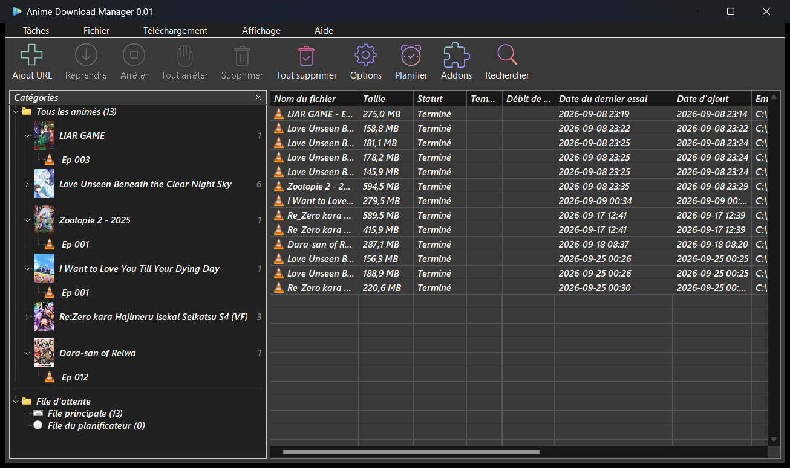
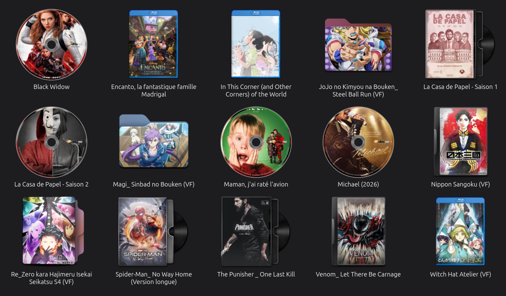

<div align="center">


# Anime Download Manager

**An IDM-style download manager for anime sites** — a native Windows application in C++ and Win32.
Every source lives in an add-on, a native library loaded at run time, so the app stays small, generic and fast.

[](https://isocpp.org/)
[](https://learn.microsoft.com/windows/win32/)
[](https://cmake.org/)
[](https://www.rust-lang.org/)
[](https://developer.mozilla.org/en-US/docs/Web/JavaScript)

</div>

## Gallery

<p align="center">
  
</p>

<p align="center">
  
</p>

## Features

- **Fast, IDM-style downloads** — each video is split into segments fetched over up to 16 connections, resumed where it stopped after a pause, a crash or a reboot. HLS playlists are handled too (AES-128 included), with no ffmpeg.
- **Built around animes** — the categories panel groups the episodes under their anime and its poster; pick the episodes and the player of each, in windows of their own, as many at once as you like.
- **Batch from the clipboard** (Ctrl+Shift+V) — copy a list of pages, get one add window per anime, source already chosen.
- **Browser extension** for Chromium browsers and Firefox — a button on anime and episode pages, and over the links that lead to one.
- **Scheduler** — two queues with timed start and stop, and followed animes: new episodes are queued on release day, the ones already out are offered when you start following.
- **Folder icons** made from the poster, after the recipes of RightClickFolderIconTools, and `cover.jpg` for Aniyomi.
- **Export and import** — the ADM file, plain text, JSON, CSV, Excel and OpenDocument.
- **Beside the clock** — the close box hides the window; downloads, schedules and the extension go on, and a notification tells when an episode is done.
- **Dark and light themes**, French and English, toolbar skins (IDM `.tbi` skins, animated sprite packs, Neon).
- **Updates itself** — a new version is offered as soon as it is published.

## Install

Download `AnimeDownloadManager-<version>-setup.exe` from the [releases](https://github.com/goddivor/anime-dm/releases) tagged `win-v…` and run it. It needs **Windows 10 or 11, 64-bit**, and brings everything the application uses, ImageMagick included.

The application goes to `Program Files`; your list and settings live in `%APPDATA%\anime-dm`. Uninstalling removes them but keeps your add-ons, unless you ask otherwise; your downloaded videos are never touched.

## Sources

The app ships with **no source built in** — to actually download anything, install the sites you want from the in-app **Addon Store** (the *Addons* button). The store lists the reviewed add-ons of the official repository; to propose one, open a pull request there:

**→ [anime-dm-addons](https://github.com/goddivor/anime-dm-addons)**

## Browser extension

The extension lives in [`extension/`](extension/). Until it is published in the stores, load it as an unpacked extension (see [`extension/README.md`](extension/README.md)), then tick your browsers in *Options › General*.

## Build from source

Requirements: Windows 10/11, [MinGW-w64](https://www.mingw-w64.org/) (GCC, UCRT) and [CMake](https://cmake.org/) 3.20 or later.

```bash
cmake -S . -B build
cmake --build build --target anime-dm   # no error, no warning
```

The installer is built with [Inno Setup](https://jrsoftware.org/isinfo.php) 6 (see [`installer/README.md`](installer/README.md)); a merge into `feature/win32-cpp` builds and publishes it automatically.

## License

See repository.
